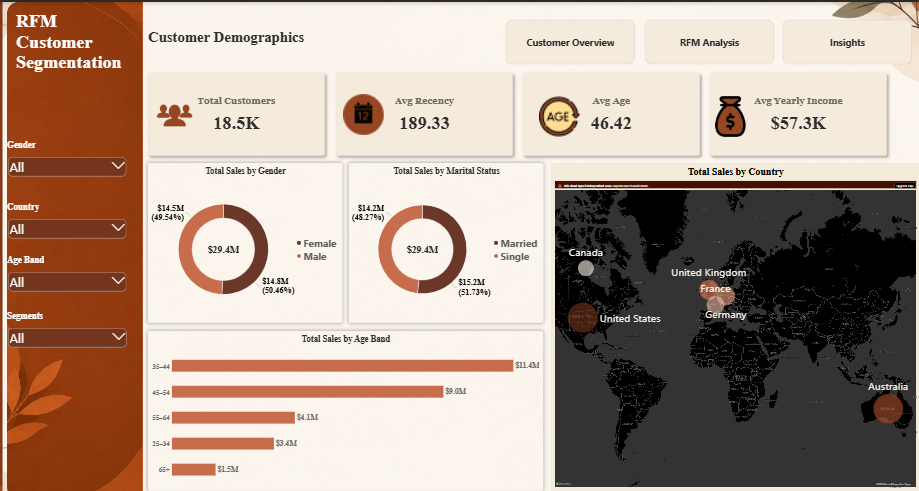
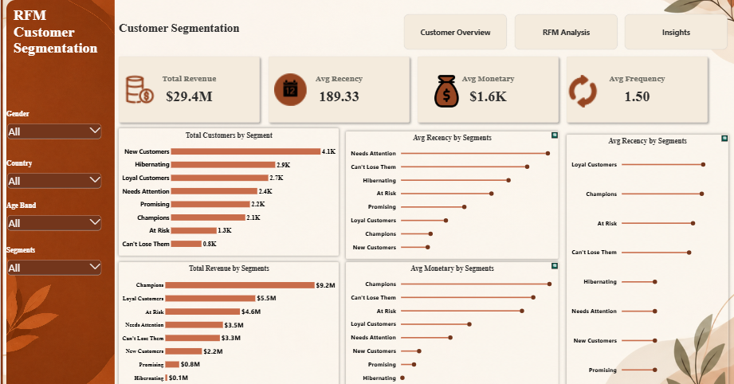
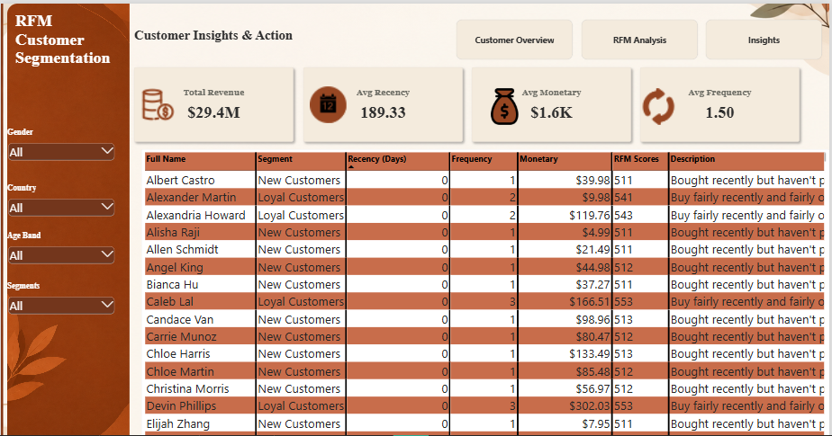

# Syntecxhub_Customer Segmentation Using RFM Analysis

# Project Overview

Customer segmentation helps businesses understand their customers beyond total sales. Instead of treating every customer the same, businesses can group customers based on their purchasing behavior and develop more targeted retention and marketing strategies.

In this project, I used RFM Analysis to segment customers based on:

Recency: How recently a customer made a purchase

Frequency: How often a customer made a purchase

Monetary: How much a customer spent

The analysis was performed using Power Query and Power BI, with customer demographic information incorporated to provide additional context around each segment.

The final Power BI report contains:

a. Customer Overview

b. RFM Analysis

c. Customer Insights & Action

d. Customer Details Drillthrough

# Business Problem

The business has a large customer base but lacks a clear understanding of how customers differ in terms of purchasing behavior and value.

Without customer segmentation, it becomes difficult to:

a. Identify the most valuable customers

b. Recognize loyal customers

c. Identify customers showing signs of inactivity

d. Understand which customers may require re-engagement

e. Develop targeted marketing and retention strategies

f. Understand the demographic characteristics of different customer groups

The goal of this project was therefore to transform transaction data into actionable customer segments.

# Dashboards Preview

Customer Demographics

Customer Segmentation

Customer Insights & Actions

# Project Objectives

The analysis aimed to:

1. Understand customer purchasing behavior.

2. Segment customers according to their Recency, Frequency and Monetary value.

3. Identify high-value, loyal, new and inactive customer groups.

4. Understand the demographic characteristics of customers.

5. Measure the revenue contribution of each customer segment.

6. Identify segments that may require retention or re-engagement efforts.

7. Provide marketing actions appropriate to each segment.

8. Build an interactive Power BI dashboard for business users.

# Dataset Overview

**AdventureWorks Dataset**

The project uses the AdventureWorks Data Warehouse dataset, a relational sales database representing a fictional bicycle and outdoor equipment business.

The dataset uses a fact-and-dimension table model.

The main purpose of the tables is to connect sales transactions with information about customers, products, dates, geography and sales territories.

**1. FactInternetSales**

FactInternetSales contains the individual online sales transactions made by customers.

Think of each row as representing a sales transaction line.

Important columns include:

| Column              | Description                                   |
| ------------------- | --------------------------------------------- |
| `CustomerKey`       | Identifies the customer who made the purchase |
| `ProductKey`        | Identifies the product purchased              |
| `SalesOrderNumber`  | Identifies the sales order/transaction        |
| `OrderDateKey`      | Links the transaction to the date dimension   |
| `OrderDate`         | Date on which the order was placed            |
| `OrderQuantity`     | Number of units purchased                     |
| `UnitPrice`         | Price of one unit                             |
| `SalesAmount`       | Revenue generated from the transaction        |
| `GeographyKey`      | Links the sale to the customer's geography    |
| `SalesTerritoryKey` | Identifies the sales territory                |

**2. DimCustomer**

DimCustomer contains information about the customers who made purchases.

Instead of describing a transaction, this table describes who the customer is.

Important columns include:

| Column              | Description                                  |
| ------------------- | -------------------------------------------- |
| `CustomerKey`       | Unique identifier for each customer          |
| `FirstName`         | Customer's first name                        |
| `LastName`          | Customer's last name                         |
| `Gender`            | Customer's gender                            |
| `BirthDate`         | Customer's date of birth                     |
| `MaritalStatus`     | Customer's marital status                    |
| `YearlyIncome`      | Customer's annual income                     |
| `EnglishEducation`  | Customer's education level                   |
| `EnglishOccupation` | Customer's occupation                        |
| `DateFirstPurchase` | Date the customer first purchased            |
| `GeographyKey`      | Links the customer to geographic information |

**Additional fields were created during the analysis:**

Full Name

Age

Age Band

**Role in this project:**

The DimCustomer table was used to understand the demographic characteristics of different customer segments.

**3. DimProduct**

DimProduct contains information about the products sold by the business.

It can be used to understand:

What products customers purchased

Product categories

Product subcategories

Product characteristics

**Role in this project:**

It was included in the data model but was not the primary focus of the RFM analysis.

**4. DimDate**

DimDate contains calendar information associated with sales transactions.

It provides fields such as:

Date

Year

Month

Quarter

Day

Date keys

**Role in this project:**

It provides the date structure used to analyze sales transactions and connect dates to the sales fact table.

**5. DimGeography**

DimGeography provides geographic information associated with customers.

It can be used to understand where customers are located.

**Role in this project:**

It supports geographic analysis and customer profiling.

**6. DimSalesTerritory**

DimSalesTerritory contains information about the sales territories associated with transactions.

**Role in this project:**

It provides additional geographical/sales-region context within the data model.

**RFM Reference Dataset**

The project also includes an RFM Table used as a reference/lookup table.

Rather than containing individual transactions, this table explains what different combinations of RFM scores represent.

It contains information such as:

| Column           | Purpose                                               |
| ---------------- | ----------------------------------------------------- |
| RFM Score        | Combination of Recency, Frequency and Monetary scores |
| Segment          | Customer segment associated with the score            |
| Description      | Explanation of the customer's behavior                |
| Marketing Action | Suggested action for that segment                     |

For example, an RFM score can be mapped to segments such as:

a. Champions

b. Loyal

c. At Risk

d. Cannot Lose Them

e. Promising

f. Needs Attention

g. New Customers

h. Hibernating Customers

This lookup table helps translate the numerical RFM analysis into business-friendly customer segments and actions.

# Data Preparation

The data was prepared using Power Query before building the dashboard.

**Key cleaning activities:**

1. Removed unnecessary columns.

2. Corrected data types.

3. Trimmed text fields.

4. Checked for missing values.

5. Checked for duplicate customer IDs.

6. Investigated duplicate product keys.

7. Verified that repeated product keys represented legitimate transactions rather than duplicate records.

8. Confirmed that there were no exact duplicate transaction rows.

9. Created a Full Name field.

10. Created customer Age and Age Band.

11. Prepared the tables for Power BI relationships.

# Data Model

The model follows a star-schema approach, with FactInternetSales acting as the central fact table and dimension tables providing descriptive information.

The key relationships include:

                  DimCustomer
                       │
                       │ CustomerKey
                       ▼
DimProduct ─────► FactInternetSales ◄───── DimDate
                       │
                       │
              ┌────────┴────────┐
              ▼                 ▼
        DimGeography      DimSalesTerritory

# DAX Measures & Calculations

This section documents the DAX used to reproduce the analysis.

**RFM Customers Table**

The RFM Customers calculated table creates one row per customer and calculates their Recency, Frequency, and Monetary values.

RFM Customers = 

VAR RefDate =

    CALCULATE(
    
        MAX(FactInternetSales[OrderDate]),
        
        ALL(FactInternetSales)
    )

RETURN

ADDCOLUMNS(

    SUMMARIZE(
    
        FactInternetSales,
        
        FactInternetSales[CustomerKey]
    ),

    "Last Purchase Date",
    
        CALCULATE(
        
            MAX(FactInternetSales[OrderDate])
            
        ),

    "Frequency",
    
        CALCULATE(
        
            DISTINCTCOUNT(FactInternetSales[SalesOrderNumber])
            
        ),

    "Monetary",
    
        CALCULATE(
        
            SUM(FactInternetSales[SalesAmount])
            
        ),

    "Recency (Days)",
    
        DATEDIFF(
        
            CALCULATE(
            
                MAX(FactInternetSales[OrderDate])
                
            ),
            
            RefDate,
            
            DAY
        )
)

** SEGMENT LOOKUP Table**

The Segment Lookup table contains the business definitions and recommended actions for each RFM segment.

Segment Lookup =

DATATABLE(

    "Segment", STRING,
    
    "Description", STRING,
    
    "Recommended Action", STRING,
    
    {
        {
            "Champions",
            
            "Bought recently, buy often, and spend the most",
            
            "Reward with loyalty perks, early access, referral incentives"
            
        },
        
        {
        
            "Loyal Customers",
            
            "Buy fairly recently and fairly often",
            
            "Upsell higher-value products, ask for reviews/referrals"
            
        },
        
        {
        
            "New Customers",
            
            "Bought recently but haven't purchased much yet",
            
            "Onboard with welcome offers, encourage a second purchase"
            
        },
        
        {
            "Promising",
            
            "Recent buyers, still building purchase frequency",
            
            "Offer product recommendations to build habit"
        },
        
        {
            "At Risk",
            
            "Used to buy often, haven't purchased recently",
            
            "Send win-back campaign, personalized discount"
        },
        
        {
            "Can't Lose Them",
            
            "Were highly frequent buyers, now inactive",
            
            "Urgent personal outreach, high-value win-back offer"
            
        },
        
        {
            "Hibernating",
            
            "Low recency, frequency, and spend",
            
            "Low-cost re-engagement campaign, or deprioritize"
            
        },
        
        {
            "Needs Attention",
            
            "Middling across recency, frequency, and spend",
            
            "Monitor; targeted offer to push toward Loyal"
            
        }
        
    }
    
)

**RFM Metrics**

**1. Recency**

Recency measures the number of days between a customer's most recent purchase and the latest transaction date in the dataset.

Recency =

DATEDIFF(

    CALCULATE(MAX(FactInternetSales[OrderDate])),
    
    CALCULATE(MAX(FactInternetSales[OrderDate]), ALL(FactInternetSales)),
    
    DAY
)

**Interpretation**

Lower Recency = more recent purchase

Higher Recency = customer has been inactive for longer

**2. Frequency**

Frequency measures how many distinct orders a customer has made.

Frequency =

CALCULATE(

    DISTINCTCOUNT(FactInternetSales[SalesOrderNumber])
    
)

**Interpretation**

A higher Frequency indicates that the customer has made purchases more frequently.

**3. Monetary**

Monetary measures the total revenue generated by a customer.

Monetary =

CALCULATE(

    SUM(FactInternetSales[SalesAmount])
)

**Interpretation**

A higher Monetary value indicates a greater contribution to total revenue.

**Customer Metrics**

**4. Customer Count**

This measure counts the customers included in the RFM analysis.

Customer Count =

DISTINCTCOUNT('RFM Customers'[CustomerKey])

**5. Total Revenue**

This measure calculates the total revenue generated by the selected customers/segments.

Total Revenue =

SUM(FactInternetSales[SalesAmount])

**6. Average Recency**

Avg Recency =

AVERAGE('RFM Customers'[Recency])

This measures the average number of days since customers last purchased.

**7. Average Frequency**

Avg Frequency =

AVERAGE('RFM Customers'[Frequency])

This measures the average number of purchases made by customers.

**8. Average Monetary**
    
Avg Monetary =

AVERAGE('RFM Customers'[Monetary])

This measures the average revenue generated per customer.

**Percentage Measures**

**9. Percentage of Customers**

This measure shows the proportion of customers represented by the current segment.

% of Customers =

DIVIDE(

    [Customer Count],
    
    CALCULATE(
    
        [Customer Count],
        
        ALL('RFM Customers'[RFM Segment])
        
    )
    
)

This allows the dashboard to answer:

What percentage of the customer base belongs to this segment?

**10. Percentage of Revenue**

This measure shows the percentage of total revenue contributed by the selected RFM segment.

% of Revenue =

DIVIDE(

    [Total Revenue],
    
    CALCULATE(
    
        [Total Revenue],
        
        ALL('RFM Customers'[RFM Segment])
        
    )
)

This allows the business to compare customer volume with revenue contribution.

# RFM Scoring

The RFM scores convert the raw RFM metrics into standardized scores ranging from 1 to 5.

The scoring principle is:

**Recency Score**

Because lower Recency is better:

More recent purchase → Higher score

**Frequency Score**

Because higher Frequency indicates more purchasing activity:

More purchases → Higher score

Fewer purchases → Lower score

**Monetary Score**

Because higher Monetary value indicates greater revenue contribution:

Higher spending → Higher score

Lower spending → Lower score

The individual scores are then combined to create an overall RFM Score used for customer segmentation.

**Customer Segmentation**

The final RFM score is mapped to a customer segment using the RFM reference table.

The resulting segments include:

Champions

Loyal

Potential Loyalist

Promising

New Customers

About To Sleep

At Risk

Cannot Lose Them

Hibernating Customers

Lost Customers

Need Attention

Each segment represents a different combination of customer recency, purchasing frequency, and monetary value.

# Key Findings

The analysis identified 18,484 customers with approximately $29.4 million in total sales revenue.

| Segment               | Customers| Revenue |
| --------------------- | --------:| ------: |
| At Risk               |     1.3K | $4.60M |
| Hibernating Customers |     2.9K | $117.8K|
| Champions             |     2.1K | $9.2M |
| Promising             |     2.2K | $849K |
| Loyal                 |     2.7K | $5.5M |
| New Customers         |     4.1K | $2.2M |
| Cannot Lose Them      |      845 | $3.3M |
| Need Attention        |     2.4K |$3.5M |

**Overall**

The analysis grouped **18,484 customers** into **8 customer segments** using RFM (Recency, Frequency, and Monetary). Together, these customers generated about **$29.4M in historical revenue**.

### 1. Champions generate a large share of revenue

Champions make up **11.4% of customers** (2,100 customers), but they generate **31.3% of total revenue** ($9.2M).

They spend an average of **$4,381 per customer**, which is the highest of all the segments. This shows that a small group of customers contributes a large share of the company's revenue.

### 2. At-risk customers have a lot of revenue tied to them

**At Risk** customers (1,300 customers, $4.6M) and **Can't Lose Them** customers (845 customers, $3.3M) together make up **11.7% of customers**, but account for **26.8% of total revenue** ($7.9M).

These customers used to buy frequently but have not purchased recently. **Can't Lose Them** customers are especially important because they have an average value of **$3,905 per customer**, the second-highest among the segments.

This makes these groups important targets for customer re-engagement and retention efforts.

### 3. New Customers are the largest group

**New Customers** are the largest segment, making up **22.3% of customers** (4,100 customers). However, they generate only **7.5% of total revenue** ($2.2M).

They spend an average of **$537 per customer**, which is expected because they are still new. Encouraging these customers to make repeat purchases could help increase their value over time.

### 4. Hibernating customers generate very little revenue

**Hibernating Customers** make up **15.8% of customers** (2,900 customers), but generate only **0.4% of total revenue** ($117.8K).

Their average revenue is only **$41 per customer**, making this a low-value segment compared with the other groups.

### 5. Loyal Customers provide a steady source of revenue

**Loyal Customers** make up **14.7% of customers** (2,700 customers) and generate **18.7% of total revenue** ($5.5M).

They spend an average amount compared with the higher-value segments and provide a steady base of repeat customers.

### Marketing Recommendations

**1. Champions: Keep them loyal and encourage referrals**

Champions make up 11.4% of customers but generate 31.3% of revenue. Keeping these customers engaged is important because they contribute a large share of the company's revenue.

Offer loyalty rewards, early access to new products, and referral incentives. Where possible, provide more personalized communication to maintain the relationship.

**2. Can't Lose Them and At Risk: Focus on bringing them back**

These two groups account for $7.9M, or 26.8% of total revenue, so they should receive attention.

• **Can't Lose Them:** These 845 customers used to buy frequently but are no longer active. Use personalized emails or calls and meaningful offers to encourage them to return.

• **At Risk:** These 1,300 customers also have a history of frequent purchases but have not purchased recently. Use win-back emails, limited-time discounts, or personalized product offers to encourage another purchase.

**3. New Customers: Encourage a second purchase**

New Customers are the largest group, making up 22.3% of customers, but they generate only $537 per customer on average.

The focus should be on turning these first-time buyers into repeat customers. A simple onboarding process could include a welcome message, product recommendations based on their first purchase, and an offer for their second purchase.

**4. Hibernating: Use low-cost marketing**

Hibernating customers generate only about $41 per customer on average, so they may not justify a large marketing budget.

A low-cost re-engagement email can be used to try to bring some of them back. If they remain inactive, marketing resources can be focused on higher value segments such as At Risk and Can't Lose Them.

**5. Loyal Customers: Help them become Champions**

Loyal Customers make up 14.7% of customers and generate 18.7% of revenue. They already purchase regularly, making them a good group for upselling and cross-selling.

Recommend higher-value products or related products to increase their spending and encourage them to move toward the Champions segment.

**6. Needs Attention and Promising: Keep them engaged**

These customers are in the middle and do not show an immediate high-risk or high-value pattern.

Use regular but simple communication, such as product recommendations or occasional offers, to keep them engaged and prevent them from becoming inactive.

# Project File

**To view the full workflow, download the pbix file below:**

[Download Customer_Dashboard.pbix](Customer_Segmentation_Using_RFM_Analysis.pbix) 

